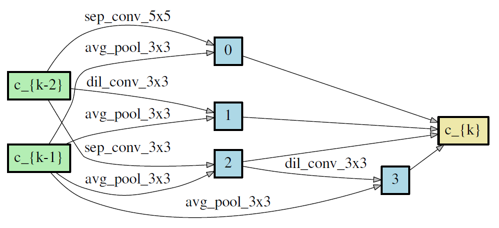
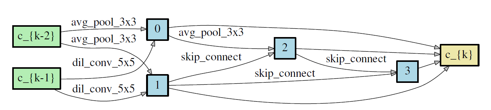
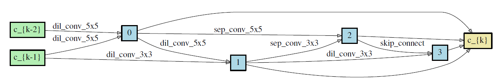
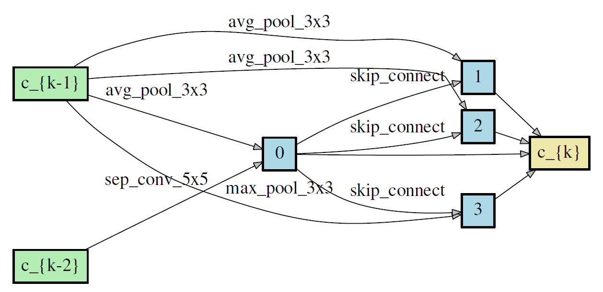

# T-NAS

PyTorch implementation  of ICLR2020 paper 'Towards Fast Adaptation of Neural Architectures with Meta Learning'

# Requirements
- python: 3.x
- Pytorch: 1.0+
- tensorboardX >= 1.4
- torchvision >= 0.2.1
- ptflops


# Usage
## Search T-NAS in Mini-Imagenet
    bash train_tnas.sh
    
    
## Evaluate T-NAS in Mini-Imagenet
   Here, the workload is very high, because we only get meta-theta in search stage. It is worthing note that the network weights cannot
   be used to transfer to evaluate the final performance. Similar other NAS (e.g., darts) and auto-maml, we need to train the model from 
   scratch. In the implementation, we set 600 tasks (consistent with meta learning) to evaluate. Therefore, you need to do the following steps:
   1) for each task, decoding the architecture theta according to the 5-way, 1/5-shot samples.
   2) training each decoded arch to get weights with maml method and pick the best model in the validation set.
   3) for each task, test the model in 5-way, 15-query samples.
   4) average the results of 600 tasks. 
   
   About training time: each model needs about 6h to converge in a single GTX 1080. So you need about 600*6h = 3600h in total in a single GTX 1080.
   
    
## Search auto-maml architecture in Mini-Imagenet
    bash train_auto_maml.sh
    
1. 5-way, 1-shot

normal cell and reduction cell

<p float="center">
    
    
</p>


2. 5-way, 5-shot

normal cell and reduction cell

<p float="center">
    
    
</p>


## Evaluate auto-maml in Mini-Imagenet
    bash train_auto_maml_from_scratch.sh


# Citation

```
@article{lian2020iclr,
    Author    = {Dongze Lian, Yin Zheng, Yintao Xu, Yanxiong Lu, Leyu Lin, Peilin Zhao, Junzhou Huang, Shenghua Gao.},
    Title     = {Towards Fast Adaptation of Neural Architectures with Meta Learning.},
    Journal   = {ICLR},
    Year      = {2020}
    }
```